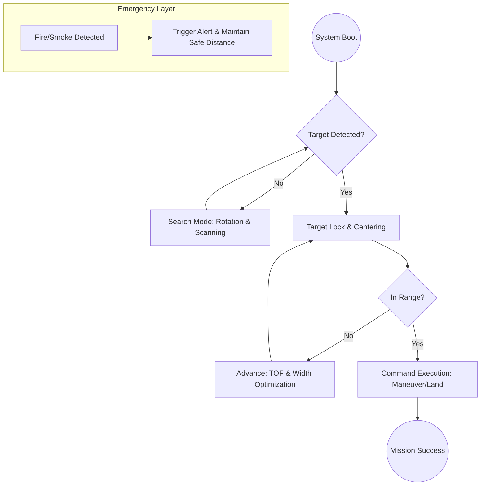

<div align="center">

# 🛰️ Tello DeepSync
### **Autonomous AI-Powered Drone Navigation System**

[](https://www.python.org/)
[](https://ultralytics.com)
[](https://opencv.org/)
[](https://vitejs.dev/)
[](https://threejs.org/)

---

**Tello DeepSync** is a cutting-edge autonomous flight framework for DJI Tello drones. By leveraging **YOLOv8** for real-time object detection and **Advanced Computer Vision**, it enables drones to perceive their environment, follow complex directional cues, and identify hazards like fire or smoke with surgical precision.

[Explore Features](#-key-capabilities) • [System Architecture](#-autonomous-logic-flow) • [Installation](#-quick-start)

</div>

---

## 🚀 Key Capabilities

- **🤖 Full Autonomy**: Intelligent search and track algorithms for hands-free navigation.
- **🎯 Precision AI**: Specialized YOLOv8 models for directional arrows, gesture signs, and hazard detection.
- **🖥️ Tactical HUD**: A professional, fighter-pilot style telemetry overlay featuring:
    - **Live Telemetry**: Altitude, Speed, and Temperature.
    - **Safety Failsafes**: Auto-landing at <10% battery and thermal monitoring.
    - **Vision Feedback**: AI processing FPS, confidence scores, and target locking.
- **🧵 Multi-Threaded Engine**: High-performance architecture separating AI inference, telemetry polling, and flight control.

---

## 📊 System Architecture

The following diagram illustrates the decision-making pipeline of the DeepSync engine:



---

## 🛠️ Tech Stack

| Component | Technology |
| :--- | :--- |
| **Core Logic** | Python 3.8+ |
| **AI Engine** | Ultralytics YOLOv8 |
| **Vision** | OpenCV, NumPy |
| **Drone Interface** | DJITelloPy SDK |
| **Visualization** | Vite & Three.js (Future Dashboard) |

---

## ⚡ Quick Start

### 1. Install Dependencies
Ensure you have Python installed, then run:
```bash
pip install opencv-python ultralytics djitellopy numpy
```

### 2. Connect & Fly
1. Power on your **DJI Tello**.
2. Connect your PC to the drone's Wi-Fi.
3. Launch the core system:
```bash
python fly.py
```

### ⌨️ Key Commands
| Key | Action |
| :--- | :--- |
| **T** | Takeoff (Enables Auto-Search) |
| **L** | Land Immediately |
| **Q** | Emergency Shutdown & Quit |
| **C** | Re-establish Connection |

---

<div align="center">
  <sub>Developed for advanced autonomous research and search & rescue simulations.</sub>
</div>
