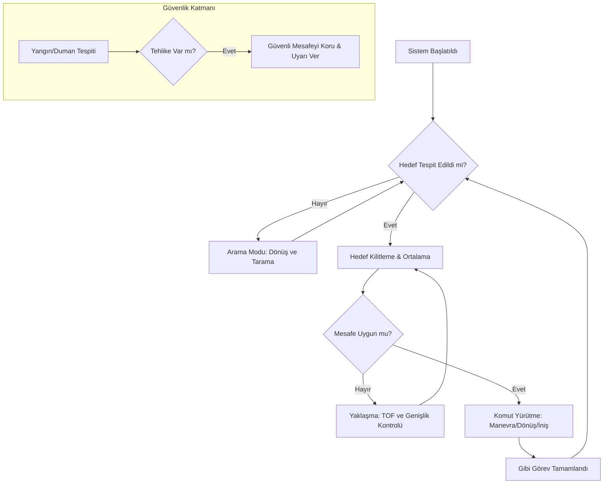

  
  
  
</div>


# 🛰️ Tello DeepSync: Otonom Yapay Zeka Drone Sistemi

Tello DeepSync, DJI Tello dronları için geliştirilmiş, **YOLOv8** nesne algılama motoruyla güçlendirilmiş gelişmiş bir otonom uçuş sistemidir. Sistem, karmaşık ortamlarda navigasyon yapabilir, yön işaretlerini tanıyabilir, tehlikeleri (yangın/duman) tespit edebilir ve manevraları tamamen otonom olarak gerçekleştirebilir.

---

## ✨ Temel Özellikler

- **🤖 Otonom Navigasyon**: Görsel ipuçlarına dayalı arama, takip ve komut yürütme mantığı.
- **🎯 YOLOv8 Entegrasyonu**: Yön okları, manevra işaretleri ve yangın/duman tespiti için yüksek hızlı nesne algılama.
- **🖥️ Gelişmiş HUD (Heads-Up Display)**: Profesyonel kokpit tarzı arayüz:
    - Gerçek zamanlı Telemetri (İrtifa, Hız, Sıcaklık)
    - Pil Durumu ve Failsafe Uyarıları
    - Yapay Zeka FPS ve Hedef Kilitleme Durumu
    - Canlı TOF (Time of Flight) Sensör Verileri
- **🧵 Çok Kanallı Mimari**: AI işleme, telemetri ve uçuş mantığı için optimize edilmiş ayrı iş parçacıkları (threading).
- **🛡️ Güvenlik Sistemleri**: Kritik pil seviyesi koruması (<%10 otomatik iniş) ve sıcaklık uyarıları.

---

## 📊 Sistem Akış Diyagramı

Aşağıdaki diyagram, sistemin otonom karar verme sürecini göstermektedir:



---

## 🛠️ Teknoloji Yığını

- **Dil:** Python 3.8+
- **Görüntü İşleme:** OpenCV, NumPy
- **Yapay Zeka:** Ultralytics YOLOv8
- **Drone SDK:** DJITelloPy
- **Görselleştirme:** Vite & Three.js (Gelecek Planı/Dashboard)

---

## 🚀 Kurulum

Bağımlılıkları pip aracılığıyla yükleyin:

```bash
pip install opencv-python ultralytics djitellopy numpy
```

## 🎮 Kullanım Kılavuzu

1. **Bağlantı**: DJI Tello'yu açın ve bilgisayarınızı dronun Wi-Fi ağına bağlayın.
2. **Çalıştır**: Ana betiği başlatın:
   ```bash
   python fly.py
   ```
3. **Kontroller**:
   - `T`: Kalkış (Otomatik arama modu başlar)
   - `L`: İniş
   - `Q`: Çıkış ve Acil Durum Kapatma
   - `C`: Drona Yeniden Bağlan

---

## 🧠 Otonom Mantık Akışı

1. **Arama**: Drone, tanınan bir hedef bulmak için ileri hareket eder veya döner.
2. **Takip**: Bir hedef (örneğin "yukarı ok") algılandığında, drone onu görüş alanının merkezine odaklar.
3. **Yaklaşma**: Drone, "tetikleme genişliğine" veya ideal TOF mesafesine ulaşana kadar hedefe yaklaşır.
4. **Yürütme**: Drone, hedefle ilişkili komutu (Dönme, Yukarı/Aşağı, Takla vb.) gerçekleştirir.
5. **Tehlike Algılama**: Yangın veya duman tespit edilirse, drone güvenliğe öncelik verir, uyarı verir ve mesafesini korur.

---

<div align="center">
  <sub>Gelişmiş otonom drone araştırmaları ve arama-kurtarma simülasyonları için geliştirilmiştir.</sub>
</div>
