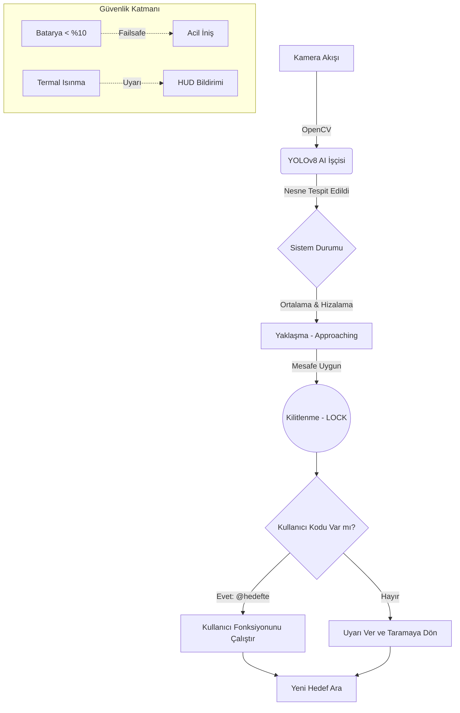

# 🛰️ Tello DeepSync: Otonom Yapay Zeka SDK & Eğitim Müfredatı

Tello DeepSync SDK, karmaşık görüntü işleme (Computer Vision) ve yapay zeka (YOLOv8) algoritmalarını soyutlayarak, öğrencilerin ve geliştiricilerin basit, **olay güdümlü (event-driven)** bir yapıyla Tello dronelarını programlamasını sağlayan profesyonel bir kütüphanedir.

Bu kapsamlı dokümantasyon, modülün tüm teknik API detaylarını ve Almanya'da gerçekleştirilecek 4 Günlük "Otonom Drone" eğitim kampının (workshop) gün gün müfredatını içermektedir.

---

## 🏗️ 1. Sistem Mimarisi ve Çalışma Prensibi

Tello DeepSync SDK arka planda Asenkron Çoklu İşlem (Multi-threading) mimarisi kullanır. Sensörlerden gelen veriler, kameradan gelen akış ve yapay zeka çıkarımı (AI Inference) birbirini beklemeden farklı iş parçacıklarında çalışır. Kullanıcı (öğrenci) ise bu karmaşadan tamamen izole edilir ve sadece **görevlere (callbacks)** odaklanır.



> [!TIP]
> **Eğitmen Notu:** Simülasyon modunda uçmak için `tello_otonom.py` içindeki 11. satırı `SIMULASYON_MODU_ZORLA = True` yapmayı unutmayın!

---

## 📚 2. SDK Dokümantasyonu (API Referansı)

Sistem `OtonomSistem` ana sınıfı üzerinden çalışır. Görevler `@hedefte(işaret_ismi)` dekoratörü ile tanımlanır.

### Sınıf: `OtonomSistem`

Ana kontrol mekanizmasıdır. Hem gerçek Tello'ya hem de Three.js tabanlı simülasyona bağlanabilir.

| Metod/Özellik | Açıklama |
| :--- | :--- |
| `__init__()` | Telemetriyi, AI modellerini ve uçuş değişkenlerini sıfırlar, bağlantıyı başlatır. |
| `hedefte(isim: str)` | Hedef tespit edilip dron kilitlendiğinde tetiklenecek fonksiyonu bağlayan **Decorator**. |
| `baslat()` | Kamerayı, yapay zeka arayüzünü (HUD) ve sensör okumalarını başlatır. Kod bu satırda sonsuz döngüye girer. |

### 🎮 Tam Kapsamlı Uçuş Komutları (`tello` nesnesi üzerinden)

Öğrenciler, görev fonksiyonlarına gönderilen `tello` parametresi üzerinden aşağıdaki tüm komutları kullanarak drona diledikleri akrobasiyi ve hareketi yaptırabilirler. Mesafe birimleri **santimetre (cm)**, açılar ise **derece** cinsindendir.

#### 🧭 1. Yön ve Hareket Komutları
* `tello.move_forward(x)`: `x` cm ileri gider. (Örn: `tello.move_forward(30)`)
* `tello.move_back(x)`: `x` cm geri gider.
* `tello.move_left(x)`: `x` cm sola gider.
* `tello.move_right(x)`: `x` cm sağa gider.
* `tello.move_up(x)`: `x` cm yukarı yükselir.
* `tello.move_down(x)`: `x` cm aşağı alçalır.

#### 🔄 2. Dönüş Komutları
* `tello.rotate_clockwise(x)`: Kendi ekseni etrafında saat yönünde (sağa) `x` derece döner. (Örn: 90, 180, 360)
* `tello.rotate_counter_clockwise(x)`: Kendi ekseni etrafında saat yönünün tersine (sola) `x` derece döner.

#### 🤸 3. Akrobasi ve Takla Komutları
*Not: Takla komutları sadece gerçek drone'da ve yeterli batarya/yükseklik varken çalışır.*
* `tello.flip_forward()`: İleriye doğru takla atar.
* `tello.flip_back()`: Geriye doğru takla atar.
* `tello.flip_left()`: Sola doğru takla atar.
* `tello.flip_right()`: Sağa doğru takla atar.

#### ⚙️ 4. Temel Sistem Komutları
* `tello.takeoff()`: Dronu manuel olarak havalandırır. (Otonom sistem başlatıldığında `T` tuşu ile de otomatik kalkış yapılabilir).
* `tello.land()`: Motorları yavaşlatarak güvenli bir iniş gerçekleştirir. Otonom parkurun sonunda mutlaka kullanılmalıdır.
* `tello.stop()`: Dronun o anki hareketini iptal eder ve havada sabit durmasını (Hover) sağlar.

#### 📊 5. Sensör ve Bilgi Okuma (Telemetri)
Öğrenciler bu komutları `print()` ile konsola yazdırıp dronun durumunu kontrol edebilirler:
* `tello.get_battery()`: Dronun anlık batarya yüzdesini döndürür (Örn: `85`).
* `tello.get_height()`: Dronun yerden yüksekliğini cm cinsinden döndürür.
* `tello.get_temperature()`: Dronun iç sıcaklığını Celcius cinsinden döndürür.
* `tello.get_flight_time()`: Motorlar çalıştıktan sonra geçen süreyi saniye olarak verir.

> [!WARNING]
> Öğrencilerin kod yazarken komutların altına uyku (`time.sleep()`) koymasına gerek yoktur; sistem görev tamamlanana kadar diğer işlemleri güvenle bekletir.

---

## 🗓️ 3. Almanya Etkinliği: 4 Günlük Gelişmiş Eğitim Müfredatı

Bu eğitim programı 10-18 yaş arası öğrenciler veya giriş seviyesi Python bilen geliştiriciler için özel olarak optimize edilmiştir. Etkinliğin ilk günleri **Simülatör** üzerinden (dronların kırılmasını/şarjının bitmesini engellemek için), son günleri ise **Fiziksel Tello**'lar ile yapılmalıdır.

### 🚩 1. Gün: "Hello Drone" - Python ve Otonomiye Giriş
* **Amaç:** Öğrencilerin kodlamaya ısınması, fonksiyon ve kütüphane mantığını anlaması. AI'nin dünyayı nasıl gördüğünü (Bounding Boxes) kavramak.
* **Aktiviteler:**
  1. Python kurulumları ve simülatör web arayüzünün (`npm run dev`) başlatılması.
  2. Uçuş için ilk Python scriptinin yazılması (`baslangic.py`).
* **Öğrenci Görevi:** Dronun sadece düz gidip bir "Yukarı" oku gördüğünde yukarı çıkmasını kodlamak.

```python
from tello_otonom import OtonomSistem

drone = OtonomSistem()

@drone.hedefte("yukari")
def yukari_cik(tello):
    print("Yukarı oku bulundu! 30 cm yükseliyorum.")
    tello.move_up(30)

drone.baslat()
```

### 🚩 2. Gün: Görsel Algı ve Mantıksal Dönüşler (Labirent Çözümü)
* **Amaç:** Koşullu algoritmalar ve Decorator mantığını kavramak.
* **Aktiviteler:**
  1. Yerde U veya Z şeklinde bir harita hazırlanır (veya simülatöre oklar yerleştirilir).
  2. Sistemin otonom merkezleme (Centering) algoritmasının izlenmesi.
* **Öğrenci Görevi:** Hiç klavyeye dokunmadan, dronun doğru oklarda doğru açıyla (90 derece) dönmesini sağlayan eksiksiz bir dönüş algoritması (Routing) yazmak.

```python
# 2. Gün Örnek Öğrenci Çıktısı
@drone.hedefte("soladon")
def sola_donus(tello):
    tello.rotate_counter_clockwise(90)
    tello.move_forward(40) # Döndükten sonra otonom olarak ilerle

@drone.hedefte("sagadon")
def saga_donus(tello):
    tello.rotate_clockwise(90)
    tello.move_forward(40)
```

### 🚩 3. Gün: Arama ve Kurtarma (Search & Rescue) Senaryosu
* **Amaç:** Hata koruma (Failsafe) ve gerçek dünya problemlerini (Yangın) otonom çözme.
* **Aktiviteler:**
  1. Yapay Zeka modellerine giriş (Projedeki `fire.pt` modelinin çalışma mantığı).
  2. Öğrencilere "Acil Durum Protokolü" yazdırmak.
* **Öğrenci Görevi:** Sınıfa/Simülasyona yapay alev/duman işaretleri koyulur. Drone devriye uçuşu yaparken ateşi gördüğü an **güvenli mesafeye kaçmalı** ve durumu ekrana yazdırmalıdır.

> [!IMPORTANT]
> Yangın senaryosunda drone ateşe yaklaşmamalıdır. Sistem otonom olarak geriye çekilecek şekilde yapılandırılmış olsa da, öğrencinin koda ekstra geri kaçma komutu eklemesi puan kazandırır.

```python
@drone.hedefte("fire")
def yangin_protokolu(tello):
    print("ACİL DURUM! Orman yangını tespit edildi!")
    tello.move_up(20) # Kuşbakışı görmek için yüksel
    tello.move_back(50) # Alevlerden uzaklaş
```

### 🚩 4. Gün: Hackathon - Tam Otonom Parkur Yarışması!
* **Format:** Tüm öğrenciler takımlara ayrılır. Ekiplere karmaşık, bol dönüşlü, sahte "Yangın" tuzaklı ve "Takla" işaretlerinin olduğu dev bir harita verilir.
* **Kurallar:**
  1. Kod yazmak için 1 saat süre verilir.
  2. Başlama komutundan sonra bilgisayara dokunan takım diskalifiye olur.
  3. Drone engelleri geçip bitiş çizgisine ("parkurson") ulaşmalı ve kendi başına inmelidir.
* **Puanlama Sistemi (Değerlendirme Kriterleri):**
  * Otonom kalkış ve sorunsuz hedef bulma: 20 Puan
  * Yangın tuzaklarına düşmeden güvenli manevra: 30 Puan
  * "Takla" işaretinde havada artistik takla atma: 20 Puan
  * Bitiş işaretinde tam ve kusursuz otomatik iniş: 30 Puan

---

## 🔧 Sorun Giderme (Troubleshooting) ve Sık Sorulan Sorular

1. **Soru:** Ekran siyah açılıyor ve "WI-FI KONTROL ET" uyarısı veriyor.
   * **Cevap:** Gerçek drone modunda PC'nin Tello'nun kendi Wi-Fi ağına bağlı olduğundan emin olun.
2. **Soru:** "WinError 10048 - Adres kullanımda" hatası alıyoruz.
   * **Cevap:** Arka planda açık kalan başka bir Python scripti 8889 numaralı UDP portunu kilitliyor. Görev yöneticisinden açık olan `python.exe`leri kapatın.
3. **Soru:** Drone oku görüyor ama hareket etmiyor!
   * **Cevap:** Drone, oku gördükten sonra ona hizalanmalı ve yaklaşmalıdır. Güvenli mesafeye ve merkeze (`is_aligned`) ulaştığında fonksiyonu tetikler. Etraftaki ışık azsa okları büyütmeyi deneyin.
